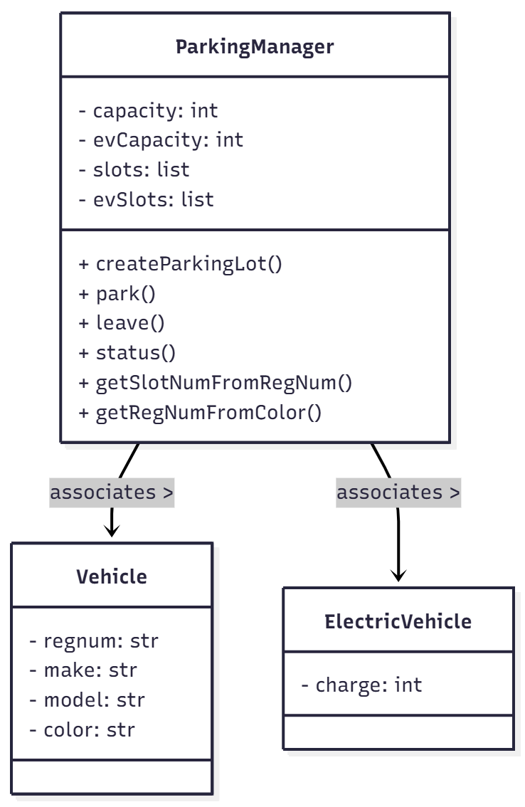
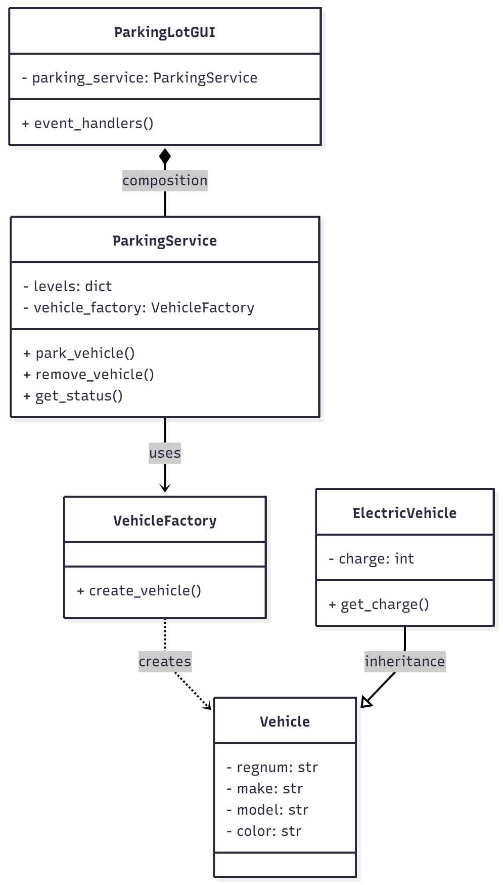
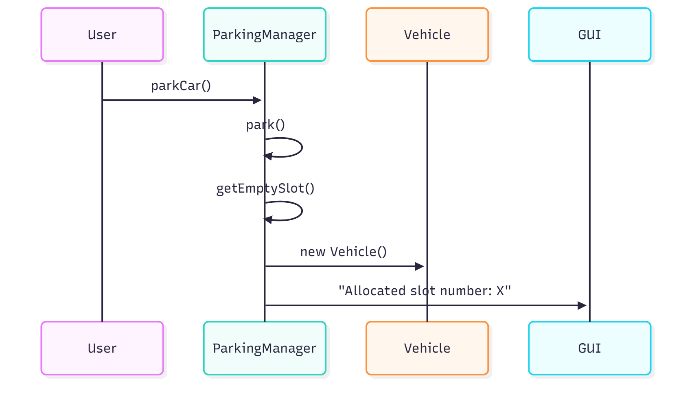
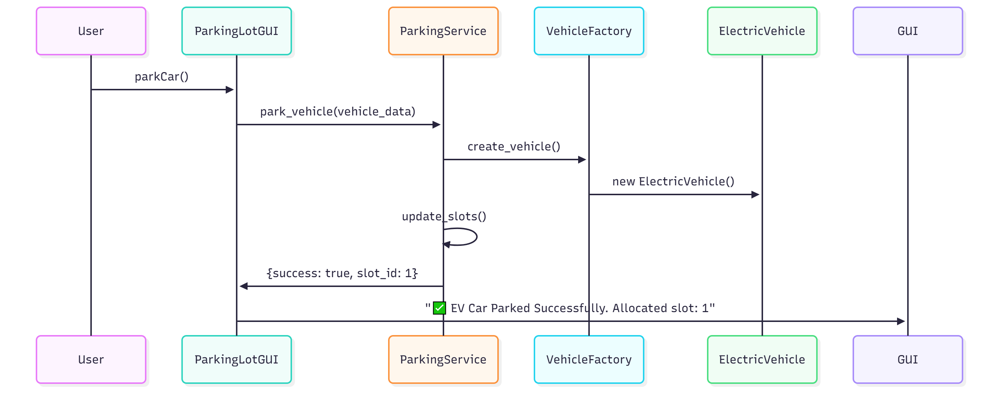
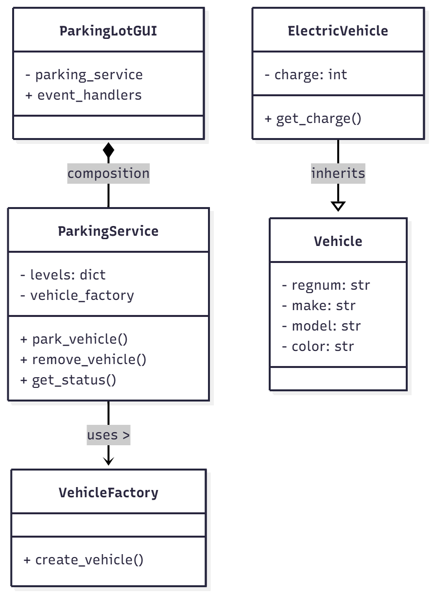
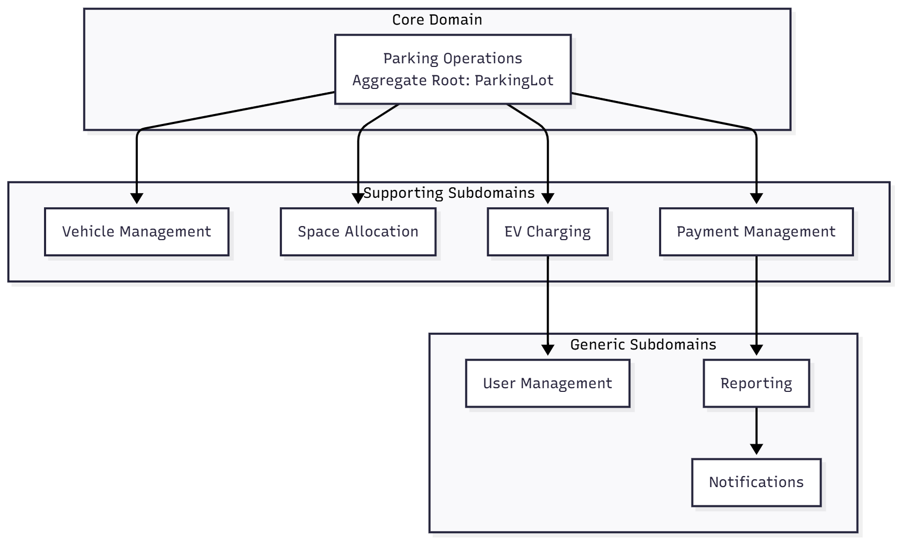
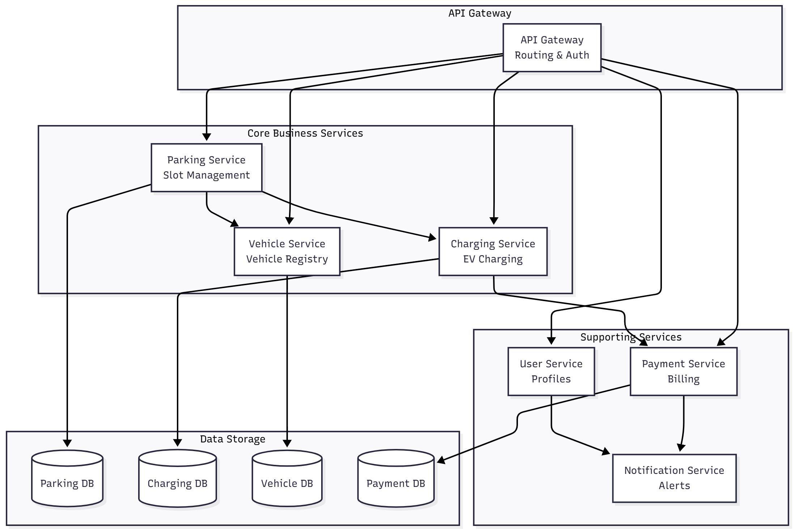
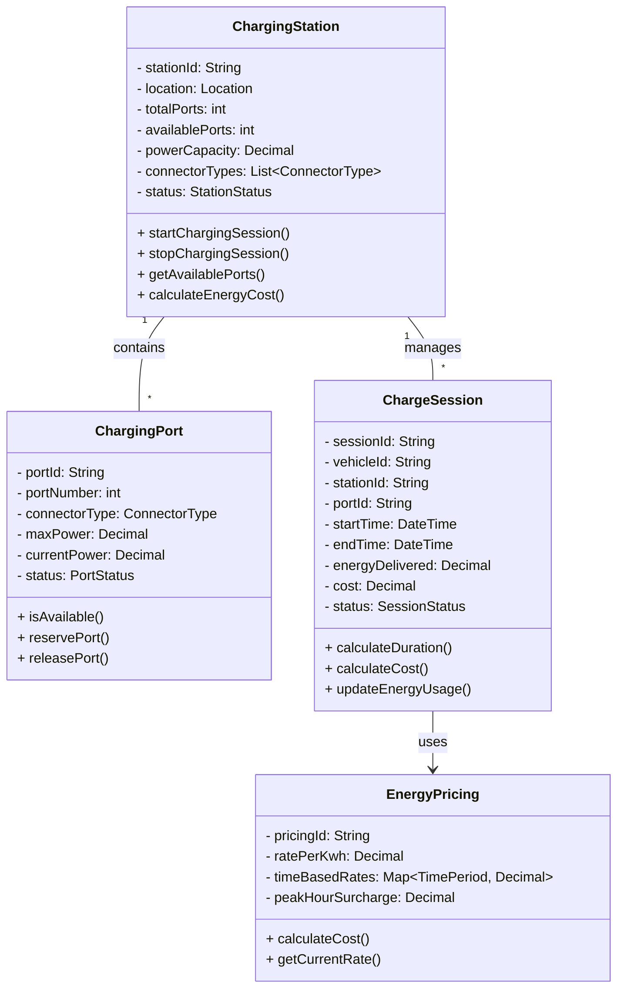

## Current System Behavior - Phase 1

### What Works:
- GUI loads with all input fields and buttons
- Parking lot creation with valid inputs
- Basic form rendering

# Anti-Patterns Identification - Phase 1

## Summary of Anti-Patterns Found:

1. **No Input Validation** - Crashes when converting empty strings to int
2. **Inheritance Bugs** - ElectricVehicle classes don't properly inherit  
3. **Poor Error Handling** - Unhelpful error messages
4. **God Class** - ParkingManager does everything

## Detailed Analysis:

### 1. No Input Validation
**Evidence:** Screenshot `002_error_input_validation_empty_fields.png`

**Problem:** 
- Code attempts `int("")` without validation at `ParkingManager.py:279`
- Application crashes with technical error message instead of user-friendly guidance
- Poor user experience - no indication of required fields

**Impact:** Users encounter crashes instead of helpful validation messages

### 2. Inheritance Bugs  
**Evidence:** Code analysis of `ElectricVehicle.py`

**Problem:**
- `ElectricCar` and `ElectricBike` classes don't properly inherit from `ElectricVehicle`
- Missing `ElectricVehicle(Vehicle)` inheritance chain
- Results in `TypeError` when trying to use EV functionality

**Impact:** Electric vehicle functionality is completely broken

### 3. Poor Error Handling
**Evidence:** Various error messages throughout application

**Problem:**
- Technical stack traces shown to end users
- No graceful error recovery
- Misleading messages like "parking lot full" when lot is empty

**Impact:** Confusing user experience and difficult debugging

### 4. God Class Anti-Pattern
**Evidence:** `ParkingManager.py` (400+ lines)

**Problem:**
- Single class handles GUI, business logic, data management, and vehicle operations
- Violates Single Responsibility Principle
- Difficult to test, maintain, and extend

**Impact:** Poor code organization and scalability limitations

### Test Results:
- ✅ Parking lot creation: WORKS with valid inputs
- ⚠️ Vehicle parking: TO BE TESTED
- ⚠️ EV functionality: LIKELY BROKEN due to inheritance

### 5. Poor User Feedback System

**Evidence:** 
- Both regular and EV vehicles show identical "Allocated slot number: 1" messages
- Confirmation messages break table formatting and appear inline with data cells
- Console outputs accumulate without clearing, creating visual clutter
- Multiple "Vehicles" headers repeat in status displays

**Problems:**
- Identical slot numbering for different slot types (regular vs EV) causes confusion
- Success messages disrupt table layout and are difficult to read
- No separation between operational messages and data presentation
- Historical outputs stack up, obscuring current system state
- Missing clear empty state indicators

**Impact:** 
- Users may miss critical confirmation messages due to poor visual placement
- Difficult to distinguish current parking lot status from historical data
- Poor information architecture leads to user confusion and potential errors
- Unprofessional user experience that undermines user confidence

**What Good Design Would Do:**
- Separate confirmation messages from data tables using dedicated message areas
- Provide clear visual distinction between different types of information
- Implement consistent message placement following established UX patterns
- Clear console between major operations to maintain focus on current state
- Design clean empty states with clear "No vehicles parked" messaging
- Use distinct slot numbering systems (REG-1 vs EV-1) to avoid ambiguity

## Phase 2: Critical Bug Fixes & Initial Refactoring

### 2.1 ElectricVehicle Inheritance Fix
**Changes Made:**
- Fixed ElectricVehicle to inherit from Vehicle
- Used super() for proper inheritance chain
- Maintained backward compatibility

**Code:**
```python
from Vehicle import Vehicle

class ElectricVehicle(Vehicle):
    def __init__(self, regnum, make, model, color):
        super().__init__(regnum, make, model, color)
        self.charge = 0

### 2.4 Testing Results - EV Inheritance Fixed, New UI Issue Found

**Success Confirmed:**
- ✅ ElectricVehicle inheritance properly fixed - EV parking functional
- ✅ Both regular and EV slot systems work independently
- ✅ No crashes or TypeError exceptions

**New Issue Discovered:**
- ❌ Console output corruption in Tkinter text widget
- ❌ Race condition when multiple operations execute rapidly
- ❌ User experience impacted by mangled display

**Evidence:** Single comprehensive screenshot `phase2_01_ev_working_but_output_bug.png` demonstrates both the successful EV functionality and the new output display issue.

## Phase 3: Complete Business Logic Separation & UI Enhancement

### 3.1 Business Logic Extraction to ParkingService
**Goal:** Fully separate business logic from GUI by moving core operations to ParkingService

**Methods Extracted to ParkingService:**
- `park_vehicle()` - Handles all vehicle parking logic
- `remove_vehicle()` - Manages vehicle removal operations  
- `get_status()` - Provides parking lot status data
- Enhanced `VehicleFactory` - Centralized vehicle creation

**Architecture Achieved:**

ParkingService (Business Logic Layer)
├── park_vehicle() - Parking operations
├── remove_vehicle() - Removal operations
├── get_status() - Status reporting
└── VehicleFactory - Vehicle creation

ParkingManager (GUI Layer - Pure Delegation)
├── Event handlers only
├── UI coordination
└── User feedback presentation

### 3.2 Professional Package Structure Implementation
**Achieved:** Proper Python package organization with separated concerns

**New Structure:**

ParkingManager/ # Main package
├── main.py # Minimal entry point (15 lines)
├── ParkingLot.py # GUI integration layer (300 lines)
├── ParkingService.py # Business logic layer (150 lines)
├── models/ # Vehicle class hierarchy
│ ├── Vehicle.py
│ └── ElectricVehicle.py
└── config.py # Global configuration


**Benefits:**
- Reduced God Class from 817 to ~300 lines
- Clear separation of GUI, business logic, and data models
- Professional, scalable architecture
- Maintainable and testable codebase

### 3.3 Critical Bug Fixes Implemented

#### **Fixed: Vehicle Removal System**
**Problem:** "Unable to remove a car from slot" errors due to data synchronization issues

**Solution:** 
- Implemented `remove_vehicle()` in ParkingService
- Proper slot indexing and validation
- Synchronized data between old and new systems during transition

**Evidence:** Console shows "✅ Vehicle removed from slot 2" success messages

#### **Fixed: Status Display Data Synchronization**
**Problem:** Status showed empty tables despite parked vehicles

**Solution:**
- `get_status()` method provides real data from ParkingService
- Proper vehicle data serialization for display
- Clear separation between data processing and presentation

### 3.4 User Experience Improvements

#### **Enhanced Messaging System**
**Before:** "Allocated slot number: 1"
**After:** "✅ EV Car Parked Successfully. Allocated slot: 1"

**Features Added:**
- Emoji indicators (✅ success, ❌ error, 🔄 action)
- Descriptive vehicle types in messages
- Professional formatting and spacing

#### **UI Organization & New Features**
**Added Section Headers:**
- "Lot Creation" 
- "Car Management"
- "Vehicle Removal" 
- "Search & Status"

**New Buttons:**
- "Clear Parking Lot" - Resets entire parking lot
- "Clear Inputs" - Clears form fields for new operations
- Consistent coloring and positioning

#### **Complete Feature Set:**
- Motorcycle checkbox in removal section
- EV vehicle type handling throughout
- Consistent input validation
- Professional workflow management

### 3.5 Enhanced Status Display & Welcome System
**Welcome Experience:**
- "🚗 Welcome to Parking Lot Manager!"
- "👉 Start by creating a parking lot with the 'Create Lot' button above."

**Professional Status Display:**
- Vehicle types clearly shown (Car, Motorcycle, EV Car)
- Section headers with icons (🅿️ Regular Vehicles, ⚡ Electric Vehicles)
- "Type" column showing vehicle classification
- Clean, professional table formatting

### 3.6 Testing Results - Phase 3

**Verified Functionality:**
- ✅ Vehicle parking (regular and EV) with clear success messages
- ✅ Vehicle removal with proper slot validation
- ✅ Status display shows actual parked vehicles with types
- ✅ Multiple parking lot levels supported (Level 1, Level 2)
- ✅ Input clearing and parking lot reset functionality
- ✅ Error handling for full parking lots and invalid operations
- ✅ Professional package structure operational
- ✅ Welcome system and user guidance working

**User Workflow Demonstrated:**
1. Welcome message guides new users
2. Create parking lot → "Created a parking lot with 20 regular slots and 10 EV slots on level: 1"
3. Park vehicles → "✅ Car Parked Successfully. Allocated slot: 1"
4. Remove vehicles → "✅ Vehicle removed from slot 2"  
5. Check status → Professional display with vehicle types
6. Clear inputs → "Input fields cleared"
7. Create new parking lot → "Created a parking lot with 10 regular slots and 5 EV slots on level: 2"

**Evidence:** Console output shows complete professional workflow with enhanced status display

### 3.7 Code Quality Improvements

#### **Separation of Concerns Achieved:**
- **ParkingService**: Pure business logic, no GUI dependencies
- **ParkingManager**: GUI event handling and user interaction only
- **Clear boundaries**: Each layer has single responsibility

#### **Professional Standards:**
- Comprehensive error handling throughout
- Consistent method signatures and return types
- Proper exception handling with fallback mechanisms
- Clean code organization with clear documentation
- Professional package structure and imports

### 3.8 Current Architecture Status

**Business Logic Layer (ParkingService):** ✅ COMPLETE
- Vehicle parking operations
- Vehicle removal operations  
- Status reporting
- Data management

**Presentation Layer (ParkingManager):** ✅ ENHANCED
- Professional UI with clear sections
- User-friendly messaging system
- Comprehensive input handling
- Error presentation and recovery
- Welcome system and user guidance

**Data Layer (Models):** ✅ ORGANIZED
- Proper vehicle class hierarchy
- Clean separation of concerns
- Professional package structure

### 3.9 Visual Evidence - Phase 3 Progression

**Screenshot Sequence Demonstrating Phase 3 Evolution:**

1. **`phase3_01_enhanced_ui_with_clear_buttons.png`**
   - Initial UI improvements with new Clear buttons
   - Professional section headers and organization
   - Foundation of enhanced user experience

2. **`phase3_02_successful_parking_and_removal.png`**
   - Working parking and removal functionality
   - Professional messaging system with emojis
   - Error handling for invalid operations

3. **`phase3_03_clear_status_display.png`**
   - Enhanced status display with vehicle types
   - Professional table formatting with icons
   - Accurate data synchronization between layers

4. **`phase3_04_professional_workflow_complete_after_separation_of_files.png`**
   - **COMPREHENSIVE DEMONSTRATION** of all Phase 3 achievements
   - Professional package structure working flawlessly
   - Complete user workflow from welcome to status display
   - Real-world data usage (Honda Africa Twin motorcycle)
   - All vehicle types operational with proper classification

### 3.10 Git History Evidence - Technical Transformation

**Final Phase 3 Commit Demonstrates Complete Architectural Restructuring:**
[master 595fbd0] Phase 3 COMPLETE: Professional package structure implemented
20 files changed, 1073 insertions(+), 844 deletions(-)
delete mode 100644 ParkingManager.py
create mode 100644 ParkingManager/ParkingLot.py
rename ParkingService.py => ParkingManager/ParkingService.py (64%)
create mode 100644 ParkingManager/init.py
create mode 100644 ParkingManager/config.py
create mode 100644 ParkingManager/main.py
rename ElectricVehicle.py => ParkingManager/models/ElectricVehicle.py (100%)
rename Vehicle.py => ParkingManager/models/Vehicle.py (100%)


**Technical Achievements Documented in Git:**
- ✅ **God Class ELIMINATED** - `ParkingManager.py` deleted
- ✅ **Professional Package Created** - `ParkingManager/` package structure
- ✅ **Proper File Organization** - Models moved to `ParkingManager/models/`
- ✅ **Clean Architecture** - Separation of GUI, business logic, and data layers
- ✅ **Documentation Reorganized** - Screenshots properly categorized by phase

**Quantifiable Results:**
- **20 files transformed** in single commit
- **1073 lines added** (new professional structure)
- **844 lines deleted** (old anti-patterns removed)
- **God Class eliminated** after successful separation


### 3.11 Ready for Phase 4

**Foundation Established For:**
- Design pattern implementation (Strategy, Observer, etc.)
- Domain-Driven Design analysis
- Microservices architecture planning
- Advanced feature development

**Technical Debt Identified:**
- VehicleFactory still uses dictionaries instead of actual Vehicle classes
- Some fallback methods remain for compatibility
- Console output formatting could be further improved

## Phase 4: Advanced Patterns & Submission Excellence
### 4.1 UML Diagrams - Architectural Transformation Evidence

### Original Architecture (Before Refactoring)

#### Structural UML - God Class Anti-Pattern


**Key Issues Identified:**
- **God Class**: ParkingManager handles all responsibilities (GUI, business logic, data management)
- **Broken Inheritance**: ElectricVehicle doesn't properly inherit from Vehicle
- **Tight Coupling**: No separation between presentation and business logic
- **Poor Encapsulation**: Direct manipulation of data structures

#### Behavioral UML - Monolithic Workflow


**Workflow Problems:**
- **Single Responsibility Violation**: ParkingManager does everything
- **No Abstraction**: Direct object creation and manipulation
- **Poor Error Handling**: Basic messaging without structured responses
- **Mixed Concerns**: GUI operations mixed with business logic

### Refactored Architecture (After Refactoring)

#### Structural UML - Clean Architecture


**Architectural Improvements:**
- **Separation of Concerns**: GUI (ParkingLotGUI), Business Logic (ParkingService), Data (Models)
- **Fixed Inheritance**: Proper Vehicle → ElectricVehicle hierarchy
- **Composition Over Inheritance**: ParkingLotGUI uses ParkingService
- **Factory Pattern**: Centralized vehicle creation
- **Single Responsibility**: Each class has one clear purpose

#### Structural UML - SOLID Principles Implementation


**SOLID Principles Demonstrated:**
- **Single Responsibility**: Each class has one reason to change
- **Open/Closed**: Extensible without modifying existing code
- **Liskov Substitution**: ElectricVehicle can substitute Vehicle
- **Interface Segregation**: Focused interfaces for each layer
- **Dependency Inversion**: High-level modules don't depend on low-level modules

#### Behavioral UML - Delegated Workflow


**Improved Workflow:**
- **Delegation Pattern**: GUI delegates to service layer
- **Structured Communication**: Clear data flow between components
- **Professional Messaging**: User-friendly feedback with emojis
- **Error Handling**: Comprehensive validation and error responses
- **Testable Components**: Isolated business logic for unit testing

### Architectural Evolution Summary

| Aspect | Original | Refactored | Improvement |
|--------|----------|------------|-------------|
| **Structure** | God Class | Layered Architecture | ✅ Separation of Concerns |
| **Inheritance** | Broken | Fixed Hierarchy | ✅ Proper OOP |
| **Coupling** | Tight | Loose | ✅ Maintainable |
| **Responsibility** | Mixed | Single | ✅ Testable |
| **User Experience** | Basic | Professional | ✅ User-Centered |


### 4.2 Domain-Driven Design Analysis

#### Strategic Design - Core Domains & Bounded Contexts



*Diagram generated from Mermaid code showing domain relationships and bounded contexts*

#### Bounded Contexts & Ubiquitous Language

**1. 🅿️ Parking Operations Context**
Ubiquitous Language:
• ParkingLot (Aggregate Root) - A physical parking facility with multiple levels
• ParkingSlot - Individual space for vehicle parking
• SlotAllocation - Assignment of vehicle to specific slot
• CheckIn/CheckOut - Vehicle entry and exit events
• Occupancy - Current utilization state

Domain Entities:

ParkingLot (Root)

ParkingSlots (Entity)

Floor (Value Object)

Capacity (Value Object)

Domain Services:

SlotAssignmentService

OccupancyCalculator

PricingStrategyService

text

**2. ⚡ EV Charging Context**
Ubiquitous Language:
• ChargingStation - Dedicated EV charging infrastructure
• ChargingPort - Individual charging connector
• ChargeSession - Active charging period
• EnergyDelivery - kWh transferred
• ConnectorType - Physical interface standard

Domain Entities:

ChargingStation (Root)

ChargingPorts (Entity)

PowerCapacity (Value Object)

AvailabilitySchedule (Value Object)

Domain Events:

ChargingStarted

ChargingCompleted

ChargingInterrupted

text

#### Domain Models Deep Dive

**Parking Management Domain Model:**

```python
# Aggregate Root
class ParkingLot:
    def __init__(self, lot_id: str, name: str, location: Location):
        self.lot_id = lot_id
        self.name = name
        self.location = location
        self.floors: List[Floor] = []
        self.pricing_strategy: PricingStrategy
        
    def assign_vehicle_slot(self, vehicle: Vehicle) -> SlotAssignment:
        # Domain logic for optimal slot assignment
        pass
        
    def calculate_occupancy_rate(self) -> Occupancy:
        # Domain logic for business intelligence
        pass

# Value Objects (Immutable)
@dataclass(frozen=True)
class Location:
    address: str
    coordinates: tuple
    timezone: str

@dataclass(frozen=True)  
class PricingStrategy:
    hourly_rate: Decimal
    daily_max: Decimal
    ev_surcharge: Decimal
    motorcycle_discount: Decimal
EV Charging Domain Model:

python
# Aggregate Root
class ChargingStation:
    def __init__(self, station_id: str, capacity_kw: int):
        self.station_id = station_id
        self.capacity_kw = capacity_kw
        self.ports: List[ChargingPort] = []
        self.maintenance_schedule: MaintenanceSchedule
        
    def start_charging_session(self, vehicle: ElectricVehicle, port_id: str) -> ChargeSession:
        # Domain logic ensuring business rules
        pass
        
    def calculate_energy_cost(self, session: ChargeSession) -> EnergyCost:
        # Complex pricing domain logic
        pass

# Domain Events
@dataclass
class ChargingStarted:
    session_id: str
    vehicle_id: str
    station_id: str
    start_time: datetime
    initial_charge: int
Context Mapping & Integration
text
[Parking Operations] ────[Customer/Supplier]───▶ [EV Charging]
       │                                              │
       │                                              │
       ▼                                              ▼
[Shared Kernel] ──────────[Vehicle, Time, Location]─────┘
       │
       │
       ▼
[User Management] ─────[Conformist]────▶ [Payment Processing]
Strategic Design Decisions
1. Aggregate Boundaries:

ParkingLot protects slot allocation consistency

ChargingStation manages port availability and energy allocation

Separate aggregates prevent transactional overlap

2. Domain Services:

Cross-cutting concerns handled by dedicated services

Complex business rules encapsulated in domain services

Stateless operations that don't fit entities/value objects

3. Anti-Corruption Layer:

External systems (payment gateways) isolated

Domain models protected from external changes

Adapter patterns for integration


## 🏗️ **4.3 Microservices Architecture Design**

### **Service Decomposition Strategy**



*Diagram showing microservices decomposition, API gateway routing, and database-per-service pattern*

### **Microservices Specification**

#### **1. 🅿️ Parking Service**
**Responsibilities:**
- Slot allocation and management
- Occupancy tracking and optimization
- Check-in/check-out operations
- Multi-level parking coordination
- Real-time availability updates

**API Endpoints:**
```http
POST   /api/v1/parking-lots                   # Create parking lot
GET    /api/v1/parking-lots/{id}/slots        # Get available slots
POST   /api/v1/vehicles/{id}/check-in         # Vehicle check-in
POST   /api/v1/vehicles/{id}/check-out        # Vehicle check-out
GET    /api/v1/parking-lots/{id}/status       # Current occupancy
PUT    /api/v1/parking-lots/{id}/maintenance  # Set maintenance mode
```

**Database Schema (Parking DB):**
```sql
CREATE TABLE parking_lots (
    lot_id UUID PRIMARY KEY,
    name VARCHAR(100) NOT NULL,
    location JSONB,
    total_capacity INTEGER,
    current_occupancy INTEGER DEFAULT 0,
    created_at TIMESTAMP DEFAULT NOW()
);

CREATE TABLE parking_slots (
    slot_id UUID PRIMARY KEY,
    lot_id UUID NOT NULL,
    slot_number INTEGER,
    slot_type VARCHAR(20) CHECK (slot_type IN ('REGULAR', 'EV', 'MOTORCYCLE')),
    is_occupied BOOLEAN DEFAULT false,
    is_maintenance BOOLEAN DEFAULT false
);
```

#### **2. ⚡ Charging Service**
**Responsibilities:**
- EV charging station management
- Charging session lifecycle control
- Energy consumption tracking and billing
- Port availability and power management
- Charging optimization algorithms

**API Endpoints:**
```http
POST   /api/v1/charging/stations              # Register charging station
GET    /api/v1/charging/stations/available    # Get available charging ports
POST   /api/v1/charging/sessions/start        # Start charging session
POST   /api/v1/charging/sessions/{id}/stop    # Stop charging session
GET    /api/v1/charging/sessions/{id}         # Get session status
GET    /api/v1/charging/stations/{id}/stats   # Station statistics
```

**Database Schema (Charging DB):**
```sql
CREATE TABLE charging_stations (
    station_id UUID PRIMARY KEY,
    lot_id UUID NOT NULL,
    total_ports INTEGER,
    available_ports INTEGER,
    power_capacity_kw DECIMAL,
    connector_types JSONB, -- ['CCS', 'CHAdeMO', 'Type2']
    status VARCHAR(20) DEFAULT 'ACTIVE'
);

CREATE TABLE charge_sessions (
    session_id UUID PRIMARY KEY,
    station_id UUID NOT NULL,
    vehicle_id UUID NOT NULL,
    start_time TIMESTAMP,
    end_time TIMESTAMP,
    energy_delivered_kwh DECIMAL,
    cost_amount DECIMAL,
    status VARCHAR(20) DEFAULT 'ACTIVE'
);
```

#### **3. 🚗 Vehicle Service**
**Responsibilities:**
- Vehicle registration and validation
- Owner management and profiles
- Vehicle type classification
- Historical parking pattern analysis

**API Endpoints:**
```http
POST   /api/v1/vehicles                       # Register vehicle
GET    /api/v1/vehicles/{id}                  # Get vehicle details
PUT    /api/v1/vehicles/{id}/type             # Update vehicle type
GET    /api/v1/vehicles/{id}/history          # Parking history
GET    /api/v1/vehicles/search                # Search vehicles
```

#### **4. 💳 Payment Service**
**Responsibilities:**
- Dynamic billing calculation
- Multiple payment method support
- Invoice generation and management
- Refund processing
- Pricing strategy management

**API Endpoints:**
```http
POST   /api/v1/payments/calculate             # Calculate parking fee
POST   /api/v1/payments/process               # Process payment
GET    /api/v1/payments/invoices/{id}         # Get invoice details
POST   /api/v1/payments/refunds               # Process refund
GET    /api/v1/payments/pricing-strategies    # Get pricing options
```

### **Inter-Service Communication Patterns**

#### **Synchronous REST APIs:**
```python
# Parking Service calling Vehicle Service for validation
class ParkingService:
    def validate_vehicle_registration(self, vehicle_id: str) -> bool:
        try:
            response = requests.get(
                f"http://vehicle-service:8080/api/v1/vehicles/{vehicle_id}",
                headers={'Authorization': f'Bearer {self.auth_token}'},
                timeout=3  # Circuit breaker timeout
            )
            return response.status_code == 200
        except requests.exceptions.Timeout:
            # Fallback logic or circuit breaker
            return False
```

#### **Asynchronous Event-Driven Architecture:**
```python
# Domain Events for loose coupling
@dataclass
class VehicleCheckedInEvent:
    event_id: str
    vehicle_id: str
    slot_id: str
    checkin_time: datetime
    lot_id: str
    vehicle_type: str

# Charging Service subscribes to parking events
class ChargingEventHandler:
    def handle_vehicle_checked_in(self, event: VehicleCheckedInEvent):
        if event.vehicle_type == 'ELECTRIC':
            self.notify_charging_availability(event.lot_id, event.vehicle_id)
```

### **Database Per Service Strategy**

**Benefits:**
- **Data Isolation**: Each service owns its data model
- **Independent Scaling**: Databases scale based on service load
- **Technology Freedom**: Each service can use optimal database technology
- **Failure Containment**: Database issues don't cascade across services

**Implementation:**
```yaml
# Docker Compose for development
services:
  parking-db:
    image: postgres:14
    environment:
      POSTGRES_DB: parking_service
      POSTGRES_USER: parking_user
      
  charging-db:
    image: postgres:14  
    environment:
      POSTGRES_DB: charging_service
      POSTGRES_USER: charging_user
      
  vehicle-db:
    image: mongodb:5.0  # Document store for flexible vehicle data
    environment:
      MONGO_INITDB_DATABASE: vehicle_service
```

### **API Gateway Configuration**

**Routing Rules:**
```yaml
# API Gateway routes
routes:
  - path: /api/v1/parking/**
    service: parking-service
    authentication: required
    
  - path: /api/v1/charging/**  
    service: charging-service
    authentication: required
    
  - path: /api/v1/vehicles/**
    service: vehicle-service
    authentication: required
    
  - path: /api/v1/payments/**
    service: payment-service
    authentication: required
```
```

## ⚡ **4.4 EV Charging Station Management Extension**

### **Domain Model Extension**

#### **Enhanced EV Charging Domain Model**



### **Enhanced Ubiquitous Language**

#### **EV Charging Context Expansion**
```
Core Concepts:
• SmartCharging - AI-optimized charging based on grid demand
• LoadBalancing - Distributed power allocation across ports
• ReservationWindow - Pre-booked charging time slots
• PowerSharing - Dynamic power distribution between active sessions
• BillingTier - Progressive pricing based on energy consumption

Technical Terms:
• OCPP (Open Charge Point Protocol) - Standard charging communication
• ISO 15118 - Vehicle-to-Grid communication standard
• DynamicLoadManagement - Real-time power optimization
• SessionAuthentication - Secure charging initiation
```

### **API Endpoint Design**

#### **Charging Management APIs**
```http
# Station Management
POST   /api/v2/charging/stations              # Register smart charging station
PUT    /api/v2/charging/stations/{id}         # Update station configuration
GET    /api/v2/charging/stations/{id}/health  # Station health monitoring

# Session Management
POST   /api/v2/charging/sessions              # Start smart charging session
PUT    /api/v2/charging/sessions/{id}/stop    # Stop charging session gracefully
GET    /api/v2/charging/sessions/{id}/status  # Real-time session status
POST   /api/v2/charging/sessions/{id}/pause   # Pause charging temporarily

# Reservation System
POST   /api/v2/charging/reservations          # Reserve charging time slot
PUT    /api/v2/charging/reservations/{id}     # Modify reservation
DELETE /api/v2/charging/reservations/{id}     # Cancel reservation

# Smart Features
POST   /api/v2/charging/optimize              # Optimize charging schedule
GET    /api/v2/charging/analytics/usage       # Energy usage analytics
POST   /api/v2/charging/load-balancing        # Dynamic load management
```

### **Enhanced Database Schema**

#### **EV Charging Extension Tables**
```sql
-- Smart Charging Stations
CREATE TABLE charging_stations (
    station_id UUID PRIMARY KEY,
    lot_id UUID NOT NULL,
    station_name VARCHAR(100),
    total_ports INTEGER NOT NULL,
    available_ports INTEGER DEFAULT 0,
    power_capacity_kw DECIMAL(10,2),
    smart_capabilities JSONB, -- ['LOAD_BALANCING', 'RESERVATIONS', 'DYNAMIC_PRICING']
    ocpp_protocol_version VARCHAR(10),
    status VARCHAR(20) DEFAULT 'ACTIVE',
    created_at TIMESTAMP DEFAULT NOW(),
    updated_at TIMESTAMP DEFAULT NOW()
);

-- Charging Ports with Smart Features
CREATE TABLE charging_ports (
    port_id UUID PRIMARY KEY,
    station_id UUID NOT NULL REFERENCES charging_stations(station_id),
    port_number INTEGER NOT NULL,
    connector_type VARCHAR(20) NOT NULL, -- CCS, CHAdeMO, Type2, Tesla
    max_power_kw DECIMAL(10,2),
    current_power_kw DECIMAL(10,2) DEFAULT 0,
    smart_features JSONB, -- ['DYNAMIC_POWER',AUTH_REQUIRED']
    status VARCHAR(20) DEFAULT 'AVAILABLE',
    maintenance_mode BOOLEAN DEFAULT false
);

-- Enhanced Charge Sessions
CREATE TABLE charge_sessions (
    session_id UUID PRIMARY KEY,
    station_id UUID NOT NULL,
    port_id UUID NOT NULL,
    vehicle_id UUID NOT NULL,
    start_time TIMESTAMP NOT NULL,
    end_time TIMESTAMP,
    initial_battery_percent INTEGER,
    final_battery_percent INTEGER,
    energy_delivered_kwh DECIMAL(10,2),
    cost_amount DECIMAL(10,2),
    pricing_tier VARCHAR(20),
    session_type VARCHAR(20) DEFAULT 'IMMEDIATE', -- IMMEDIATE, RESERVED, OPTIMIZED
    status VARCHAR(20) DEFAULT 'ACTIVE',
    created_at TIMESTAMP DEFAULT NOW()
);

-- Reservation System
CREATE TABLE charging_reservations (
    reservation_id UUID PRIMARY KEY,
    station_id UUID NOT NULL,
    port_id UUID NOT NULL,
    vehicle_id UUID NOT NULL,
    reserved_start_time TIMESTAMP NOT NULL,
    reserved_end_time TIMESTAMP NOT NULL,
    reservation_status VARCHAR(20) DEFAULT 'CONFIRMED',
    created_at TIMESTAMP DEFAULT NOW(),
    UNIQUE(station_id, port_id, reserved_start_time)
);

-- Dynamic Pricing Model
CREATE TABLE energy_pricing (
    pricing_id UUID PRIMARY KEY,
    base_rate_per_kwh DECIMAL(10,4),
    peak_surcharge_rate DECIMAL(10,4),
    off_peak_discount DECIMAL(10,4),
    time_of_use_rates JSONB, -- {'peak': 0.25, 'off_peak': 0.15}
    effective_date DATE NOT NULL,
    expiration_date DATE
);
```

### **Smart Charging Algorithms**

#### **Load Balancing Service**
```python
class LoadBalancingService:
    def optimize_power_distribution(self, station_id: str) -> PowerAllocation:
        """
        Smart power distribution across active charging sessions
        considering grid demand and station capacity
        """
        active_sessions = self.get_active_sessions(station_id)
        station_capacity = self.get_station_capacity(station_id)
        grid_demand = self.get_current_grid_demand()
        
        return self.calculate_optimal_allocation(
            active_sessions, station_capacity, grid_demand
        )
    
    def calculate_optimal_allocation(self, sessions, capacity, grid_demand):
        # AI-powered optimization algorithm
        # Consider vehicle battery levels, user preferences, grid stability
        optimized_allocation = {}
        
        for session in sessions:
            # Dynamic power adjustment based on multiple factors
            optimal_power = self.calculate_session_power(
                session.vehicle_type,
                session.current_battery,
                session.desired_battery,
                capacity,
                grid_demand
            )
            optimized_allocation[session.session_id] = optimal_power
            
        return optimized_allocation
```

#### **Reservation System**
```python
class ChargingReservationService:
    def create_reservation(self, reservation_data: ReservationRequest) -> Reservation:
        """
        Create a charging reservation with conflict detection and smart scheduling
        """
        # Check port availability for requested time slot
        available_ports = self.find_available_ports(
            reservation_data.station_id,
            reservation_data.start_time,
            reservation_data.duration
        )
        
        if not available_ports:
            # Suggest alternative time slots using AI prediction
            alternatives = self.suggest_alternative_slots(reservation_data)
            raise ReservationConflictError("No available ports", alternatives)
        
        # Create reservation with smart port selection
        selected_port = self.select_optimal_port(available_ports, reservation_data.vehicle_type)
        
        reservation = Reservation(
            station_id=reservation_data.station_id,
            port_id=selected_port.port_id,
            vehicle_id=reservation_data.vehicle_id,
            start_time=reservation_data.start_time,
            end_time=reservation_data.start_time + reservation_data.duration
        )
        
        return self.reservation_repository.save(reservation)
```

### **Integration with Existing System**

#### **Enhanced Parking Service Integration**
```python
class EnhancedParkingService:
    def handle_electric_vehicle_checkin(self, vehicle: ElectricVehicle, lot_id: str):
        """
        Enhanced check-in process for electric vehicles with charging integration
        """
        # Standard parking slot assignment
        parking_slot = self.assign_parking_slot(vehicle, lot_id)
        
        # EV-specific charging integration
        if vehicle.requires_charging:
            charging_options = self.charging_service.get_available_charging_options(lot_id)
            
            # Smart recommendation based on vehicle needs and station availability
            recommended_charging = self.recommend_charging_plan(
                vehicle, charging_options, parking_slot
            )
            
            return ParkingAssignmentWithCharging(
                parking_slot=parking_slot,
                charging_recommendation=recommended_charging
            )
        
        return ParkingAssignment(parking_slot=parking_slot)
```

### **Advanced Features**

#### **1. Smart Energy Management**
- **Vehicle-to-Grid (V2G)** support for energy feedback
- **Renewable energy integration** with solar/wind power
- **Demand response** participation for grid stability
- **Carbon footprint tracking** for sustainability reporting

#### **2. User Experience Enhancements**
- **Mobile app integration** for remote monitoring
- **Push notifications** for session updates
- **Charging history** and analytics dashboard
- **Loyalty programs** for frequent users

#### **3. Business Intelligence**
- **Usage pattern analysis** for capacity planning
- **Revenue optimization** through dynamic pricing
- **Maintenance prediction** using AI algorithms
- **Customer behavior analytics** for service improvement


### 4.5 Final Submission Package
[TO BE ADDED - .zip preparation, file organization]